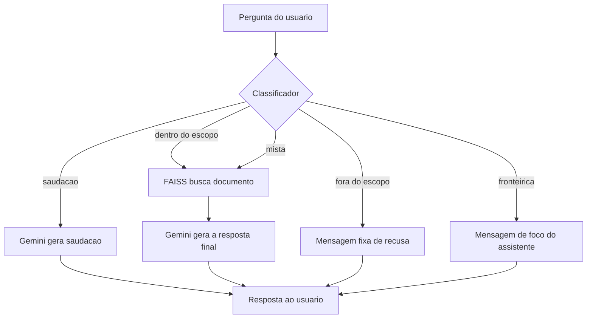

# chatbot-rag-investimentos

Agente de IA conversacional para o dominio financeiro: combina RAG, busca por similaridade (FAISS) e um filtro de escopo para respostas confiaveis e dentro do contexto certo.

## O que é

Um chatbot que responde perguntas sobre investimentos usando apenas uma base de 20 documentos proprios (RAG - Retrieval-Augmented Generation), em vez de depender so do conhecimento geral do modelo. Isso reduz alucinacao e mantem as respostas ancoradas em conteudo verificavel.

O projeto tambem implementa um gate de entrada que classifica cada pergunta em 5 categorias antes de decidir como responder - inspirado no conceito do Jev (TypeSafe AI), um modelo especializado em decisoes tipadas, mas implementado com o Gemini por nao exigir custo adicional.

## Arquitetura

O fluxo de cada pergunta segue 2 etapas: classificacao de escopo, depois resposta.

**1. Classificacao** - toda pergunta passa primeiro por um classificador (`gemini-3-flash-lite`), que a enquadra em uma de 5 categorias:

| Categoria | O que e | O que acontece a seguir |
|---|---|---|
| Saudacao | "oi", "bom dia", sem pergunta tecnica | Resposta direta, sem buscar documento |
| Dentro do escopo | Pergunta tecnica sobre investimentos | Busca no FAISS, Gemini gera a resposta |
| Fora do escopo | Sem nenhuma relacao com investimentos | Mensagem fixa de recusa, sem gastar busca |
| Fronteirica | Menciona investimentos, mas nao e tecnica | Mensagem propria, explicando o foco do assistente |
| Mista | Parte tecnica + parte sem relacao, na mesma mensagem | Busca no FAISS, Gemini declina a parte fora e responde a parte dentro |

**2. Resposta** - nas categorias que chegam ate aqui (dentro ou mista), o FAISS busca o documento mais relevante entre os 20 indexados (usando embeddings do `gemini-embedding-001`), e o `gemini-3.8-flash` gera a resposta final, com tom empatico e convicto, usando esse documento como referencia.

Em todos os casos, a resposta final e gerada pelo Gemini - a diferenca entre as categorias esta em se e com que contexto ele e chamado.

- **Classificador**: `gemini-3-flash-lite` decide se a pergunta e uma saudacao, esta dentro do escopo de investimentos, esta totalmente fora, e fronteirica (menciona investimentos mas pede algo nao tecnico) ou e mista (parte dentro, parte fora, na mesma mensagem).
- **FAISS**: busca por similaridade entre a pergunta e os 20 documentos indexados.
- **Gemini (`gemini-3.8-flash`)**: gera a resposta final, com tom empatico e convicto.
- **Memoria de conversa**: mantida em lista na memoria do programa (reinicia a cada execucao).
- **Retry automatico**: ate 3 tentativas com espera entre elas, para lidar com instabilidade do servidor (erro 503).

## Como rodar

1. Clone o repositorio e crie um ambiente virtual:
python -m venv venv
venv\Scripts\Activate

2. Instale as dependencias:

python -m pip install -r requirements.txt

3. Crie um arquivo `.env` na raiz do projeto com sua chave gratuita do Google AI Studio:

GOOGLE_API_KEY=sua_chave_aqui

4. Gere o indice de busca (so precisa rodar uma vez):

python indexar.py

5. Rode o chatbot:

python chatbot.py

## Exemplos de uso

**Pergunta tecnica simples:**

> Voce: CDB
> Chatbot: explica o CDB com base no documento, incluindo tipos de rentabilidade, liquidez e cobertura do FGC

**Pergunta de acompanhamento (testando a memoria):**

> Voce: Quero investir no tesouro selic, ele e pra perfil conservador?
> Chatbot: confirma que sim, e explica por que
> Voce: e qual a tributacao dele?
> Chatbot: entende que "dele" se refere ao Tesouro Selic, sem precisar repetir o nome

**Pergunta fora do escopo:**

> Voce: Qual a capital da Franca?
> Chatbot: Essa pergunta esta fora do que posso responder aqui, que e sobre investimentos.

## Decisoes de design

- **Gemini em vez de Anthropic**: a API da Anthropic exige compra minima de $5 em creditos, sem camada gratuita. O Gemini tem camada gratuita genuina, sem cartao de credito.
- **Gemini como classificador, em vez do Jev real**: o Jev (TypeSafe AI) e um modelo nativo para decisoes tipadas, com probabilidade calibrada, e seria tecnicamente mais adequado para a classificacao em 5 categorias. Porem, nao tem camada gratuita em nenhuma rota de acesso ($0,042 por milhao de tokens de entrada). A solucao implementada usa o proprio Gemini, instruido via prompt a responder apenas com a categoria - funciona, mas sem a mesma garantia de confianca calibrada que o Jev ofereceria nativamente.
- **Modelo mais leve para classificacao**: `gemini-3-flash-lite` e usado especificamente na funcao de classificacao, por ter uma cota gratuita diaria muito maior (~500/dia) que o `gemini-3.8-flash` (20/dia).
- **5 categorias em vez de so "dentro/fora do escopo"**: testes revelaram que perguntas fora do dominio nao sao todas iguais.
- **Tom "empatico e convicto"**: decisao intencional de comportamento do assistente, nao so de conteudo tecnico.

## Limitacoes conhecidas

- A memoria de conversa nao persiste entre execucoes do programa.
- A memoria nao realimenta a busca FAISS.
- O classificador de escopo usa correspondencia de texto simples, sem a calibracao de confianca que um modelo como o Jev ofereceria nativamente.

## Proximos passos

- Interface simples com Streamlit.
- Casos de teste automatizados para validar o classificador de 5 categorias.
- Avaliar migracao do classificador para o Jev real, caso o custo deixe de ser um impeditivo.
